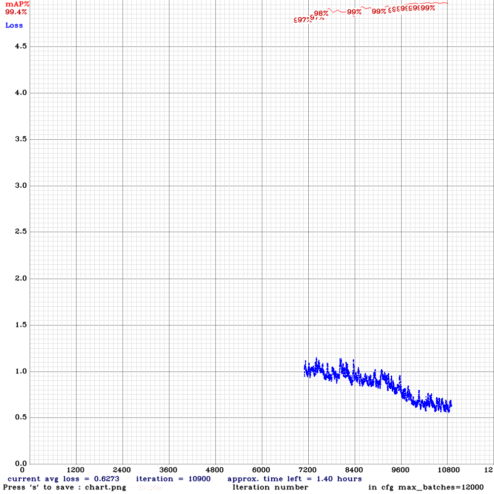
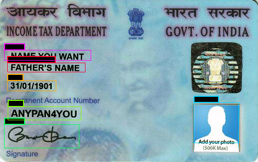
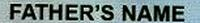
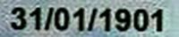
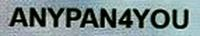

<h1>OCR using YOLO and Py-Tesseract</h1>  

<h2>Overview</h2> 
Optical Character Recognition (OCR) is used to convert scanned
images to text. Building a OCR requires regions of an image detection.
These detections are such that the selective text from the original
image can be obtained. Thus, after the text is detected, its recognition
is required.    
Test Detection consists of finding the bounding box and classifying it.
YOLO predicts both the boundary box and the class at the same time.
It is much faster but there is a tradeoff between speed and accuracy.
However, it has good enough accuracy for the application of PAN Card
OCR.    
After text detection, Py-tesseract (Python-tesseract) or Tesseract OCR
can be used as an open-source text recognizer. The difference
between two is that the OCR wrappers for Python-tesseract is based
on Googles OCR API while Tesseract OCR isn't.  


 

1. Using Vott for data tagging and labeling.    
2. Converting the labelled data to Yolo v3 Format.    
3. Done training on Darkent framework, with mean average precision as stopping criteria (-map flag).   

<h2>Motivation</h2> 
 
To understand and apply concepts of Deep Learning, Computer Vision etc.  
To ease the process of automation of financial services.  
Although there are many open-source ML-based OCR wrappers available online, but we can't use them directly for filling automated KYC forms. A tailor-made solution is required to increase the efficacy of the quality check process.   

<h2>Tech Stack</h2> 
      
Python, DNN, Darknet framework, GPU training, Computer Vision, VoTT data annotation tool, Image augmentation library called Albumentations,  

<h2>Challenges</h2> 
  
A big data set is prerequisite for training a good model. Datasets were augmented by changing parameters like brightness, contrast, orientation, etc. of raw images before data labelling.   
GPU computing but with limited access.  
To manage the rotated and skewed image regions generated by the model before performing OCR -developed a simple solution of hitting the authentication database API twice for anti-symmetric text region obtained.   

<h2>Numbers, Facts</h2> 
  
99% mAP (mean average precision)
Darknet requires 5.58 billion operations only. With DarkNet, YOLO achieves 72.9% top-1 accuracy and 91.2% top-5 accuracy on ImageNet. Darknet-53 has less BFLOP (billion floating point operations) than ResNet-152, but achieves the same classification accuracy at 2x faster.  

<h2>Specifications</h2> 

YOLOv3 uses Darknet-53 as it’s feature extractor. It has overall 53 convolutional layers. It has successive 3 × 3 and 1 × 1 convolutional layers and has some shortcut connections. For classification, independent logistic classifiers are used with the binary cross-entropy loss function.   
Darknet neural network framework is used for training and testing. The framework uses multi-scale training, lots of data augmentation and batch normalization and Leaky ReLU activation. No form of pooling is used, and a convolutional layer with stride 2 is used to downsample the feature maps. This helps in preventing the loss of low-level features often attributed to pooling. It is an open source neural network framework written in C and CUDA. It is fast and supports CPU and multi-GPU computation. Easy to modify config file to change the batch size, subdivision, number of classes and filter parameters.   

<h2>Advantages of YOLO</h2> 

Fast. Good for real-time processing.  
Predictions (object locations and classes) are made from one single network. Can be trained end-to-end to improve accuracy.  
YOLO is more generalized. It outperforms other methods when generalizing from natural images to other domains like artwork.  
Region proposal methods limit the classifier to the specific region. YOLO accesses to the whole image in predicting boundaries. With the additional context, YOLO demonstrates fewer false positives in background areas.  
YOLOv3's COCO AP metric is on par with SSD but 3x faster. But YOLOv3’s AP is still behind RetinaNet. In particular, AP@IoU=.75 drops significantly comparing with RetinaNet which suggests YOLOv3 has higher localization error. YOLOv3 also shows significant improvement in detecting small objects.  

<h2>Config file and GPU</h2> 

Train it first on 1 GPU for like 1000 iterations, Then stop and by using partially-trained model, run training with multigpu (up to 4 GPUs).   
change line batch to batch=64  
change line subdivisions to subdivisions=16  
change line max_batches to (classes*2000)  
change line steps to 80% and 90% of max_batches  
set network size width=416 height=416 or any value multiple of 32  
change line classes=80 to your number of objects  
change [filters=255] to filters=(classes + 5)x3  

<h2>Overview</h2> 
Stopping Criteria
When you see that average loss 0.xxxxxx avg no longer decreases at many iterations then you should stop training. mAP indicator is better than Loss, so train while mAP increases.  
IoU (intersect over union) - average instersect over union of objects and detections for a certain threshold = 0.24  
mAP (mean average precision) - mean value of average precisions for each class, where average precision is average value of 11 points on PR-curve for each possible threshold (each probability of detection) for the same class (Precision-Recall in terms of PascalVOC, where Precision=TP/(TP+FP) and Recall=TP/(TP+FN))  


  
The google notebook file for darknet training is attached herein in /OCR_for_PanCards/DarknetModel/YOLOv3.ipynb

```bash
	$ darknet.exe detector train data/obj.data yolo-obj.cfg "last_executed" -map
```
This has provided with, best weights based on MAP score- 10,000 is that iteration number for my data set.    
   
The weight file is provided as yolov3_custom_best_10000.weights. The google drive link to file is shared.    

Link: https://drive.google.com/open?id=1r3xue0pzWaiwODLKXDmE2bGdz42e78vx

OCR wrappers for Python- pytesseract is based on Googles OCR API and tesseract isn't. I would suggest using pytesseract based on the fact that it will be maintained better, but with that being said, try them both out and use whichever works better for you. 

I have used both OCR wrapers i.e. Tesseract and Py-tesseract and python code files are provided in /OCR_for_PanCards/PAN_OCR/MainWithPytesseract.py & /OCR_for_PanCards/PAN_OCR/MainWithTesseract.py respectively.    

    
The above image will be cropped and conveted as:    
    
    
    
    
4. To run the above main.py files, follow the instructions-

Using python3 and py-tesseract for python3.
Clone the repo and then,

Run following command in /OCR_for_PanCards/PAN_OCR/
```bash
$ bash ./darknet.sh

$ python3 MainWithPytesseract.py -d -t --weights yolov3_custom_best_10000.weights
```

Keep your images at /OCR_for_PanCards/PAN_OCR/pancards folder and see the csv file at /OCR_for_PanCards/PAN_OCR/output folder.
 


Goto [Documentation](https://github.com/sourabh-suri/Pan-Card-OCR/blob/master/Report.pdf) for all details.....
  
## Development  
Want to contribute? **:pencil:**  
  
To fix a bug or enhance an existing module, follow these steps:  
  
1. Fork the repo
2. Create a new branch (`git checkout -b exciting-stuff`)
3. Make the appropriate changes in the files
4. Add changes to reflect the changes made
5. Commit your changes (`git commit -am 'exciting-stuff!!'`)
6. Push to the branch (`git push origin exciting-stuff`)
7. Create a Pull Request
  
  
## Interested?  
If you find a bug (the app couldn't handle the query and / or gave irrelevant results), kindly open an issue [here](https://github.com/sourabh-suri/Pan-Card-OCR/issues/new) by including your search query and the expected result.  
  
If you'd like to request a new functionality, feel free to do so by opening an issue [here](https://github.com/sourabh-suri/Pan-Card-OCR/issues/new) including some sample queries and their corresponding results.
  
